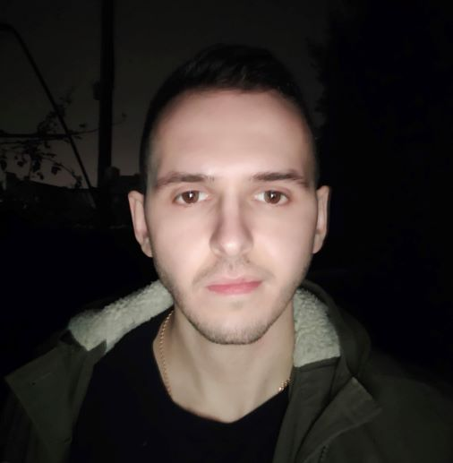

------

# **Artsiom Kasmatskou**
------
## **My contact info**
------
* **Location**: Grodno, Belarus
* **Phone number**: +375 (29) 1282922
* **E-mail**: artemkosmatkov1994@gmail.com
* **GitHub**: [artkosmos](https://github.com/artkosmos "The link to my GitHub")
* **Telegram**: [Artem Kosmos](https://t.me/art_kosmos "The link to my Telegram")
* **RSSchool server nickname**: Artem (@artkosmos)

## **About me**
------
I am 28 years old. I worked as a civil engineer, but this job didn't bring me satisfaction and I didn't see a future for myself. Now my goal is to master the modern profession of Frontend Developer and do what I'm really interested in. I want to be confident in my future.

### My strengths:
+ responsible
+ gregariuos
+ a team-player
+ hard-working

## **Skills**
------
+ HTML
+ CSS (SASS, Bootstrap)
+ Figma
+ Git (GitHub)
+ JavaSript (basic knowledge)
+ Python (basic knowledge)

## **Code example**
------
```
/* Your task is to write a function that takes two or more objects and returns
a new object which combines all the input objects.
All input object properties will have only numeric values.
Objects are combined together so that the values of matching keys are added together. */

const objA = { a: 10, b: 20, c: 30 }
const objB = { a: 3, c: 6, d: 3 }
const objC = { a: 5, d: 11, e: 8 }
const objD = { c: 3 }

function combine (...arg) {
  return arg.reduce((acc, item) => {
    for (const key in item) {
      if (acc[key]) {
        acc[key] += item[key]
      } else {
        acc[key] = item[key]
      }
    }
    return acc
  }, {})
}

console.log(combine(objA, objB, objC, objD)) // {a: 18, b: 20, c: 39, d: 14, e: 8}
```

## **Education**
------
+ **Yanka Kupala State University of Grodno**
  + Industrial and civil engineering major
+ **Courses**
  + Udemy
    + [HTML/CSS/Web development](https://www.udemy.com/share/101Wy2/ "The link to the course")
    + [JavaScript](https://www.udemy.com/share/105CnW/ "The link to the course")
  + Stepik
    + [Python for begginers](https://stepik.org/course/58852/promo "The link to the course")

## **English**
------
**A1-A2** (in progress)
I finished starter courses(~A1) and now I'm learning language at the next stage A1-A2